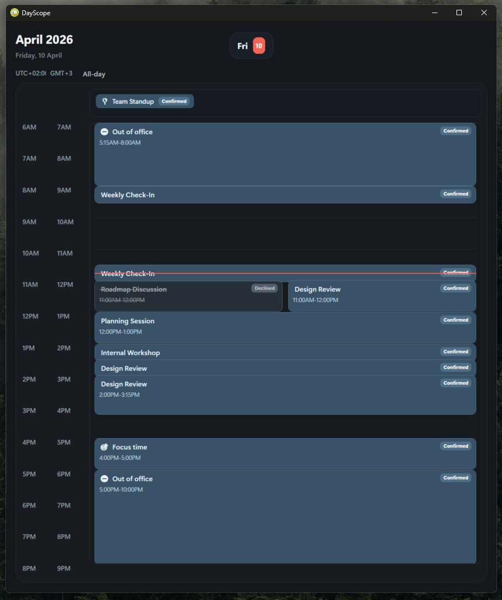

# DayScope

DayScope is a lightweight Windows desktop dashboard for a focused day view of your Google schedule.

It pulls events from Google Calendar, lays them out on a clean day timeline, highlights all-day events, shows attendance state, and can display a secondary time zone alongside the main schedule. It also shows unread Gmail inbox count for the authenticated Google account and provides quick links into Gmail and Google Calendar.

The app is designed to stay out of the way: it starts as a small desktop companion and can be hidden to the system tray, where you can reopen it, trigger a manual refresh, or exit.

## Features

- Google Calendar integration
- Gmail unread inbox counter
- Day timeline with overlapping event layout
- All-day event strip
- Event status styling for confirmed, tentative, declined, cancelled, and awaiting response
- Day navigation with previous / next controls
- Click the day header to open Google Calendar for the selected day
- Click the unread email badge to open Gmail for the authenticated account
- Event details modal with description, participants, and meeting links
- Secondary time zone column
- Configurable schedule hours, window size, and refresh interval
- System tray integration with manual refresh
- Account-aware Google links when multiple Google accounts are signed in

## Tech Stack

- .NET 10
- WPF
- Microsoft.Extensions.Hosting / DI / configuration
- Google Calendar API
- Gmail API

## Project Structure

- `src/DayScope` - WPF desktop app
- `src/DayScope.Application` - application logic and dashboard composition
- `src/DayScope.Domain` - domain models and configuration objects
- `src/DayScope.Infrastructure` - Google Calendar, Gmail, clock, and configuration wiring

## Requirements

- Windows
- .NET 10 SDK
- A Google Cloud OAuth client for desktop usage
- Google Calendar API enabled
- Gmail API enabled

## Configuration

The main settings file is:

- `src/DayScope/appsettings.json`

Important settings:

- `DaySchedule.StartHour` / `EndHour` - visible range of the day
- `DaySchedule.HourHeight` - vertical scale of the timeline
- `DaySchedule.ScheduleCanvasWidth` - preferred width of the schedule surface
- `DaySchedule.SecondaryTimeZoneId` - optional second time zone
- `GoogleCalendar.Enabled` - turn calendar sync on or off
- `GoogleCalendar.CalendarId` - usually `primary`
- `GoogleCalendar.RefreshMinutes` - automatic refresh interval
- `GoogleCalendar.ClientSecretsPath` - path to your Google OAuth client JSON
- `GoogleCalendar.TokenStoreDirectory` - where OAuth tokens are cached
- `GoogleCalendar.LoginHint` - optional Google account hint for sign-in
- `GoogleCalendar.ForceAccountSelection` - force Google account chooser on sign-in

Default local paths use `%LocalAppData%\DayScope`.

## Google Setup

1. Create an OAuth client in Google Cloud for a desktop application.
2. Enable both Google Calendar API and Gmail API for that project.
3. Save the client JSON locally.
4. Put the file at the path from `GoogleCalendar.ClientSecretsPath`, or update that setting.
5. Start the app and complete the sign-in flow on first run.

The app uses read-only Google scopes for:

- Calendar events
- Gmail inbox unread count

If you previously authorized only Calendar access, Google may ask you to approve Gmail read-only access after upgrading.

## Run

```powershell
dotnet build .\src\DayScope.slnx
dotnet run --project .\src\DayScope\DayScope.csproj
```

Example of the running app:



## UI Shortcuts

- Use `<` and `>` near the day badge to move one day backward or forward.
- Click the center day badge to open Google Calendar for the currently selected day.
- Click `Unread Emails` to open Gmail inbox for the authenticated account.
- Click any event card to open event details.
- Use event detail actions to open or copy meeting links.

## Tray Behavior

- The main window does not appear in the taskbar.
- Closing the window hides it to the system tray instead of exiting.
- Double-click the tray icon or use `Open` to show the window again.
- Use `Refresh now` in the tray menu to trigger a manual refresh.
- Use `Exit` in the tray menu to fully close the application.

## Purpose

DayScope is intended to be a focused "what does this day look like?" view rather than a full calendar client. It favors quick readability, minimal friction, and an always-available desktop presence.
